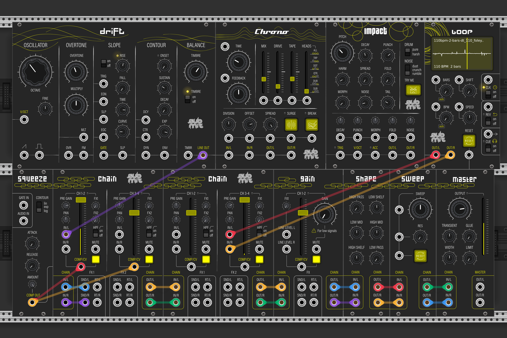

# Submit

A complete live performance toolkit for VCV Rack — 20 modules designed for sound design, rhythm and live performance.

## Modules

**Drift** — Analog voice with DCO, wavefolder, slope generator and contour envelope

**Chrono** — Tape machine with wow, flutter, drive and multi-head delay

**Impact** — Drum synthesizer with noise, harmonics and punch shaping

**Chain** — 2-channel stereo mixer with pre gain, 2 FX sends, HPF and sidechain CV

**Sum M4** — Compact 4-channel mono mixer with level, pan, mute and Chain I/O

**Sum S4** — Compact 4-channel stereo mixer with level, mute and Chain I/O

**Set** — Clocked performance timer with run/pause and selectable musical pulse output

**Pulse** — Slim visual trigger indicator and mono final-mix level/peak monitor

**Tag** — Editable patch-section label with a selectable direction arrow

**Squeeze** — Sidechain envelope follower. Feeds Chain's compressor CV input

**Shape** — 6-band SSL-style EQ. Sits in the Submit signal chain

**Master** — Warm master bus processor. Final stage of the Submit chain

**Gain** — Line level booster with soft clip and FX send

**Sweep** — DJ filter with LP/HP sweep, resonance and momentary reset

**Loop** — Sample loop player with waveform display and BPM auto-detection

**Clang** — Techno percussion synthesizer with physical-modelled and FM engines

**React** — Four-voice rhythm sequencer with genres, patterns and performance variation

**Sync** — Compact internal/external 1 PPQN clock and related clock outputs

**Flip** — Stereo clock-synchronised reverse effect with instant Flip and Freeze

**Orbit** — Rhythmic relationship processor with trigger and tension outputs

## Download

[Latest release](https://github.com/submitaudio/submit-vcv-modules/releases/latest)

## Links

- [See Manual](https://github.com/submitaudio/submit-vcv-modules/blob/master/MANUAL.md)
- [See CHANGELOG for details](https://github.com/submitaudio/submit-vcv-modules/blob/master/CHANGELOG.md)
- [Visit submitaudio.nl](https://submitaudio.nl)
- [Licensed under GPL-3.0](https://github.com/submitaudio/submit-vcv-modules/blob/master/LICENSE)
- [Report a bug](https://github.com/submitaudio/submit-vcv-modules/issues)

## License

GPL-3.0 — see [LICENSE](LICENSE)
